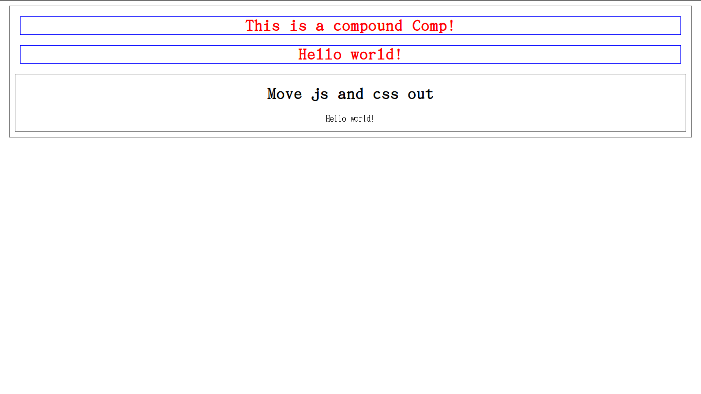

<p style="color:#3A9;text-align:center;">单文件组件</p>
===
---

<p style="color:#3A9;text-align:center;">当前问题</p>
===

1. 全局命名
2. 字符串模板
3. 没有CSS的支持，更不用说Sass之类的高级支持
4. 没有构建支持

---

<p style="color:#3A9;text-align:center;">创建单文件组件</p>
===
单文件组件以`.vue`结尾。
分两个部分
1. 模板
包在`<template>`标签中间
2. 脚本
包在`<script>`标签中间
3. 样式
包在`<style>`标签中间

---

<p style="color:#3A9;text-align:center;">单文件组件示例</p>
===
```
<template>
  <h1>{{ Greeting }}</h1>
</template>

<script>
export default {
  data: function() {
    return {
      Greeting: "Hello world!"
    };
  }
};
</script>

<style scoped>
h1 {
  color: red;
}
</style>
```

---

<p style="color:#3A9;text-align:center;">运行单文件组件</p>
===
1. 安装vue命令
```
npm install -g @vue/cli
npm install -g @vue/cli-service-global
```
2. 运行`.vue`文件
```
vue serve xxx.vue
```
默认会找: main.js、index.js、App.vue 或 app.vue中的一个。

---

<p style="color:#3A9;text-align:center;">关注点分离</p>
===
放在一个文件对于复杂的组件来说是不切实际的。
所以能放入到不同的文件中的需求是存在的。
`.vue`文件充许`.js`和`.css`文件存放到独立的文件里

```
<template>
  <div>
    <h1>Move js and css out</h1>
    <p>{{Greeting}}</p>
  </div>
</template>
<script src="./split.js"></script>
<style src="./split.css"></style>
```
---

<p style="color:#3A9;text-align:center;">关注点分离</p>
===
1. js文件内容
```
export default {
  data: function() {
    return {
      Greeting: "Hello world!"
    };
  }
};
```
2. css文件内容
```
div {
  text-align: center;
}
```

---

<p style="color:#3A9;text-align:center;">组件的组合</p>
===
如果写了好几个`.vue`组件，他们如何协同工作呢？
假设我们放到一个`.vue`文件里。
js脚本是这样的:
```js
import Basic from "./basic.vue";
import Split from "./split.vue";

export default {
  data: function() {
    return {
      Splited: "This is a compound Comp!"
    };
  },
  components: {
    Basic,
    Split
  }
};
```

---
<p style="color:#3A9;text-align:center;">组件的组合</p>
===
模板是这样的:

```
  <div>
    <h1>{{ Splited }}</h1>
    <Basic></Basic>
    <Split></Split>
  </div>
```
其中: Basic和Split就是我们的组件名。

---

<p style="color:#3A9;text-align:center;">组件的组合</p>
===
这时我们加上CSS样式，就可以把组合看的更加清楚

```
h1 {
  color: red;
  border: 1px solid blue;
  margin: 20px;
}
div {
  border: 1px solid gray;
  margin: 10px;
}
```

效果如下：

---



