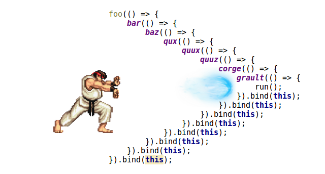

<p style="color:#3A9;text-align:center;">异步IO与代码的同步化</p><p style="text-align:right;font-size:28px;margin-right:50px;color:#888;">:star: 田一块</p>
===
---
<p style="color:#3A9;">异步与同步</p>
==
# 前提条件：1. 多线程 2. 阻塞IO
## 异步：在执行存在资源锁定（阻塞IO）的情况下，不阻止当前进，线程的执行
## 同步：在执行存在资源锁定（阻塞IO）的情况时，会阻止当前进，线程的执行

离开多线程，阻塞IO，异步就不存在了。

---
<p style="color:#3A9;">事件与异步</p>
==
1. 相同的地方
都可以使用回调函数处理

2. 不同的地方
	事件：不确定发生的时间
    异步：确定在未来的一段时间内一定完成

3. 结论
	事件：只能使用回调函数
    异步：不一定就使用回调

---
<p style="color:#3A9;">事件的处理方式</p>
==
1. 创建事件处理中心
3. 注册事件响应处理
4. 发送事件

---
<p style="color:#3A9;">创建事件处理中心</p>
===
```
// 引入事件对象
const EventEmitter = require('events');
// 创建自己的事件对象
class MyEmitter extends EventEmitter {}
// 创建事件处理中心对象 myEmitter
const myEmitter = new MyEmitter();

```

---
<p style="color:#3A9;">注册事件</p>
===
```
myEmitter.on('event', () => {
  console.log('an event occurred!');
});
```

---
<p style="color:#3A9;">发送事件</p>
===
```
myEmitter.emit('event');
```

---
<p style="color:#3A9;">Node的异步处理方式</p>
==
1. 调用异步API
2. 判断是不是出错
3. 出错做出处理A
4. 正确做出处理B

---
<p style="color:#3A9;">调用打开文件的异步API</p>
==
```
const fs = require('fs');
fs.open('file.txt', 'r', (err, fd) => {
  if (err) throw err;
  fs.close(fd, (err) => {
    if (err) throw err;
  });
});
```
---
<p style="color:#3A9;">回调地狱(callback hell)</p>
===
# 原因：Javascript/Node.js主体是单线程的
由于Javascript/node.js本身并没有多线程机制。
所以异步IO可以比较好的解决可能造成的主线程阻塞的问题。
所以一开始Node.js的API以异步的API为主。

但是在大量调用异步API后，就会发现需要大量的回调函数 。
对代码组织与阅读都是非常不利。

同时也影响循环的实现，通常需要借助第三方的库(async库)来实现

---
<p style="color:#3A9;">示例</p>
===


---
<p style="color:#3A9;">许诺器(Promise)</p>
===
Promise是解决回调地狱的方案
解决的方式：

1. Promise将嵌套变成是链接
2. Promise将错误统一处理

---

<p style="color:#3A9;">Promise是什么意思？</p>
===

Promise其实就是英语里的许诺，承诺。

那么在这里他许诺，承诺了什么呢？

其实就是承诺必定返回。

对于异步IO调用来讲，返回是非常重要的。

异步IO操作虽然时间可能会比较长，也可能直接死掉没有返回。

但是死掉是IO操作的问题，不是调用者相要的。

调用者相要的是一个承诺，就是返回

所以如果要翻译成中文，我们也可以叫Promise为`许诺器`

>许诺器是我提出来的中文翻译

---
<p style="color:#3A9;">Promise的形式</p>
===
new Promise(p0).then(f1).then(f2).then(...).catch(e1).finally(ff);

p0: (resolve, reject) => {...}
fx: (result) => {...}

其中：
1. resolve
用于回调正确时使用
2. reject
用于回调失败时。
3. then
链接的方式

---

4. catch
捕获错误信息
6. finally
最终的调用方法。通常不应该存在出错的风险调用，否则还需要catch。


---
<p style="color:#3A9;">使用Promise实现文件操作</p>
===
```
const fs = require('fs');
new Promise((resolve, reject) => {
  fs.open('file.txt', 'r', (err, fd) => {
    if (err) reject(err);
    resolve(fd);
  });
})
.then((fd) => {
  return new Promise((resolve, reject)=> {
      fs.close(fd, (err) => {
      if (err) reject(err);
      resolve();
    });
  });
})
.then(()=> {
  console.log("end of promise");
}).;
```
---
<p style="color:#3A9;">Node.js异步调用回调的统一形式</p>
===
```
(error, data) => {}
```
所以对于多数的回调可以采用统一的方式promise化。

```
const util = require('util');
const fs = require('fs');

const open = util.promisify(fs.open);
const close = util.promisify(fs.close);
open('file.txt', 'r').then((fd) => {
return close(fd);
}).then(() => {
  console.log("end of promisify");
}).catch((e) => {
  console.error("error occur" + e);
});
```
---
<p style="color:#3A9;">同步化代码</p>
===
Promise的出现解决了回调嵌套的问题，
但是并没有解决代码的同步与精练化的问题。
也就是代码的同步化问题。
代码必须在函数调用上保持链接，
否则代码的调用顺序就错乱了。

---
<p style="color:#3A9;">示例</p>
===

```
new Promise((reslove) => {
  console.log("exec 1"); reslove();
}).then(() => {
    console.log("exec 3"); 
}).then((e) => { });
console.log("exec 2");
```
执行结果：
```
exec 1
exec 2
exec 3
```
这是可以看到exec 2在exec 3之前打印。
说明promise并不能解决代码级的同步问题。

---
<p style="color:#3A9;">async/await</p>
===
实现的功能
1. 编译级的代码同步
2. 将promise的调用过程转入到编译器中执行
3. 将await后的代码全部放入到then中执行
4. 对async的函数返回Promise
5. 直接使用try...catch捕获错误

---
<p style="color:#3A9;">应用</p>
===

```
const util = require('util');
const fs = require('fs');

const open = util.promisify(fs.open);
const close = util.promisify(fs.close);

// await必须放到async函数里面
async function openAndClose() {
  const fd = await open('file.txt', 'r');
  await close(fd);
}

console.log("start open close file");
//async函数默认具备.then函数
openAndClose().then(() => {
  console.log("end of open And Close");
});
console.log("end of file");
```

---
<p style="color:#3A9;">捕获async/await错误</p>
===

```
async function openAndClose() {
  try {
    const fd = await open('file.txt', 'r');
    await close(fd);
  } catch(e) {
    console.log("error caught:" + e.message);
  }
}
```

---
<p style="color:#3A9;">异步IO及期优化的历史</p>
===
## 异步IO的问题
1. 初期导致回调过度使用。
2. 导致了代码的执行的无序化，难于编写高质量的代码
3. 导致代码的同步化成为一个课题。

## 解决异步调用的问题与代码同步化的方案分成几个历程：
1. 纯回调期
2. 许诺器(Promise)引入期
3. 生成器(Generator)利用期
4. async/await和许诺器隐藏期

---
<p style="color:#3A9;">小结</p>
===
1. 回调在事件中是不可或缺的，但是在异步调用时可以优化或者消失。
2. async/await让代码同步化，并尽可能的隐藏了许诺器(Promise)
3. 许诺器(Promise)会长期存在，也是async/await的基础


---
<p style="color:#3A9;text-align:center;">完</p>
===


